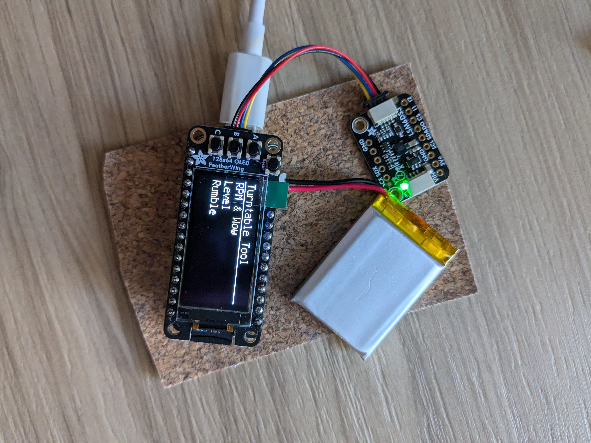
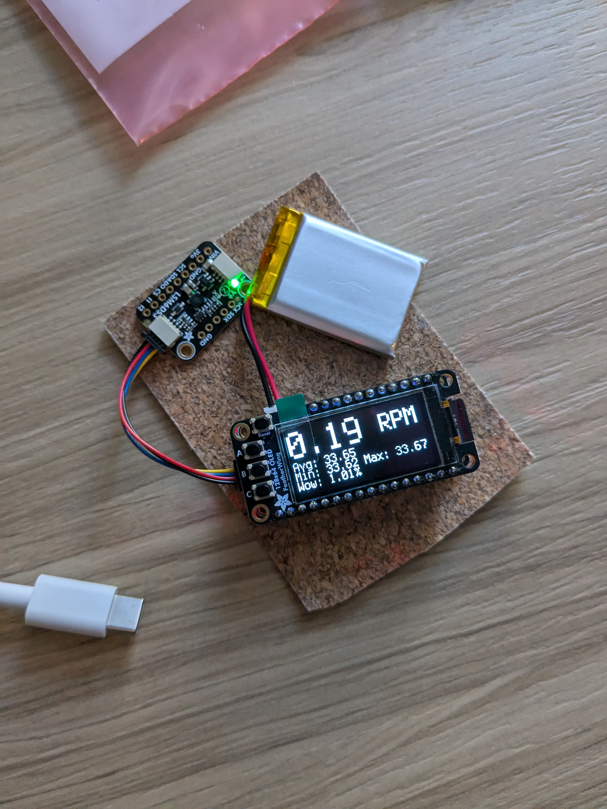
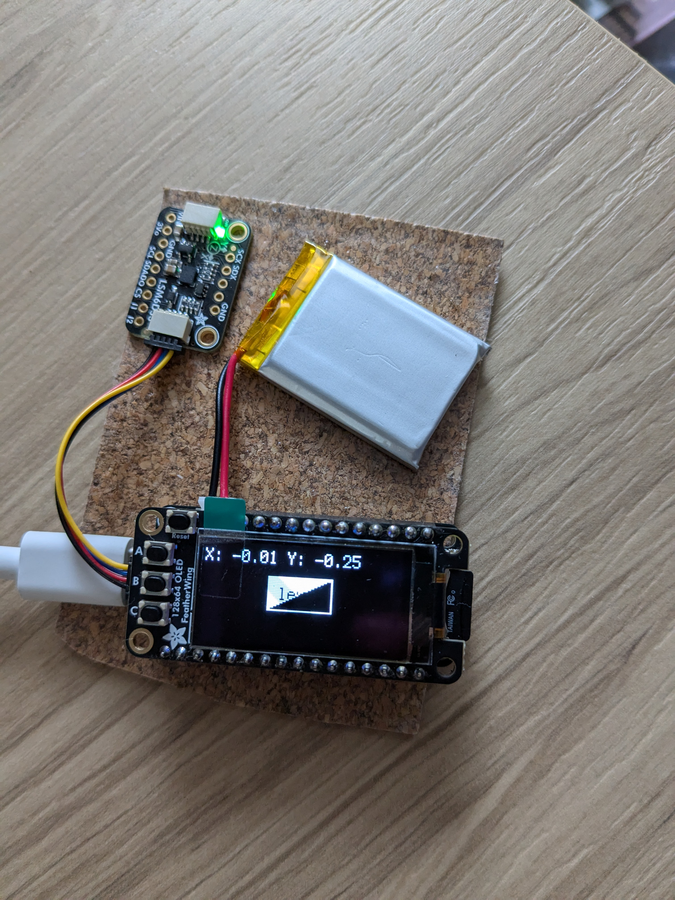
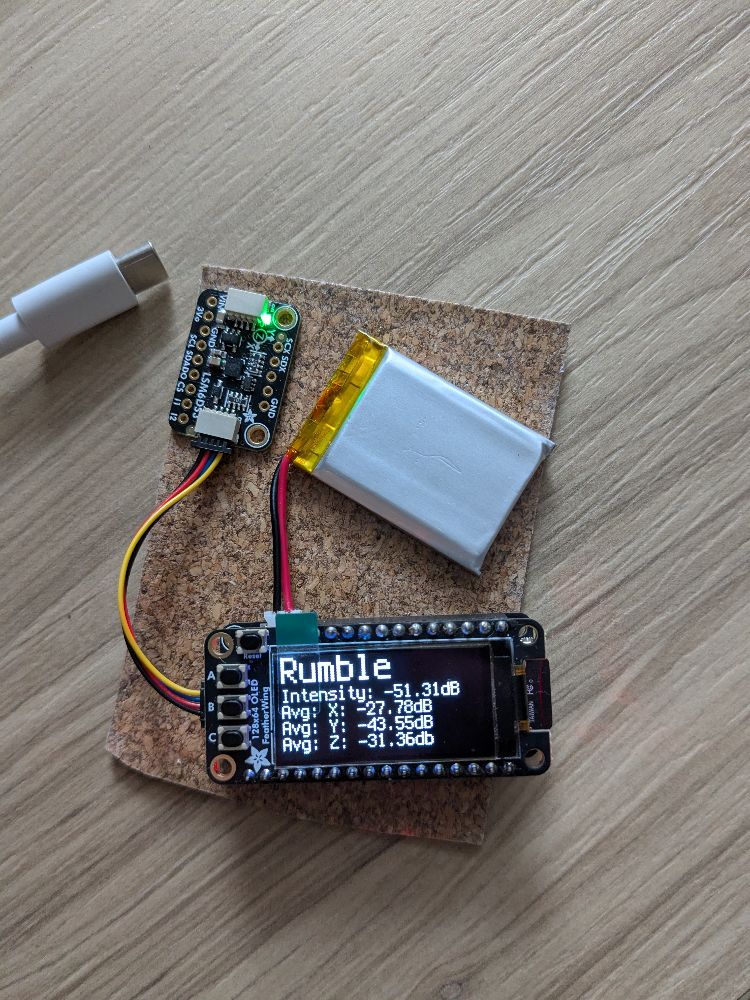

# Turntable-Tools

The goal of this project is to make an device that measure RPM, Wow, Flutter, Rumble and help Level a turntable.

Right now I am using a AdaFruit Feather board and a mems device.

## Hardware:
- [Adafruit Feather RP2040 Adalogger](https://www.adafruit.com/product/5980)
- [Adafruit FeatherWing OLED - 128x64 OLED](https://www.adafruit.com/product/4650)
- [Adafruit LSM6DS3TR-C 6-DoF Accel + Gyro IMU](https://www.adafruit.com/product/4503)
- [Battery](https://www.adafruit.com/product/4236)
- STEMMA QT 4pin cable
- Azimuth circuit (Optional)
- [Adafruit MAX17048 ](https://www.adafruit.com/product/5580) (Optional)

## Button Controls:
### Main Menu Buttons:
- A: Rpm Mode
- B: Leveling Mode
- C: Rumble Measurement not sure if this will be added

### RPM Buttons:
- A: Back to main menu
- B: Start measuring RPM data
- C: Set an offset to help if sensor is noisy

### Leveling Button:
- A: Back to main menu
- B: None
- C: Set an offset to help if sensor is noisy

### Rumble Button:
- A: Back to main menu
- B: Start measuring rumble data
- C: Set an offset to help if sensor is noisy

More to come soon.

