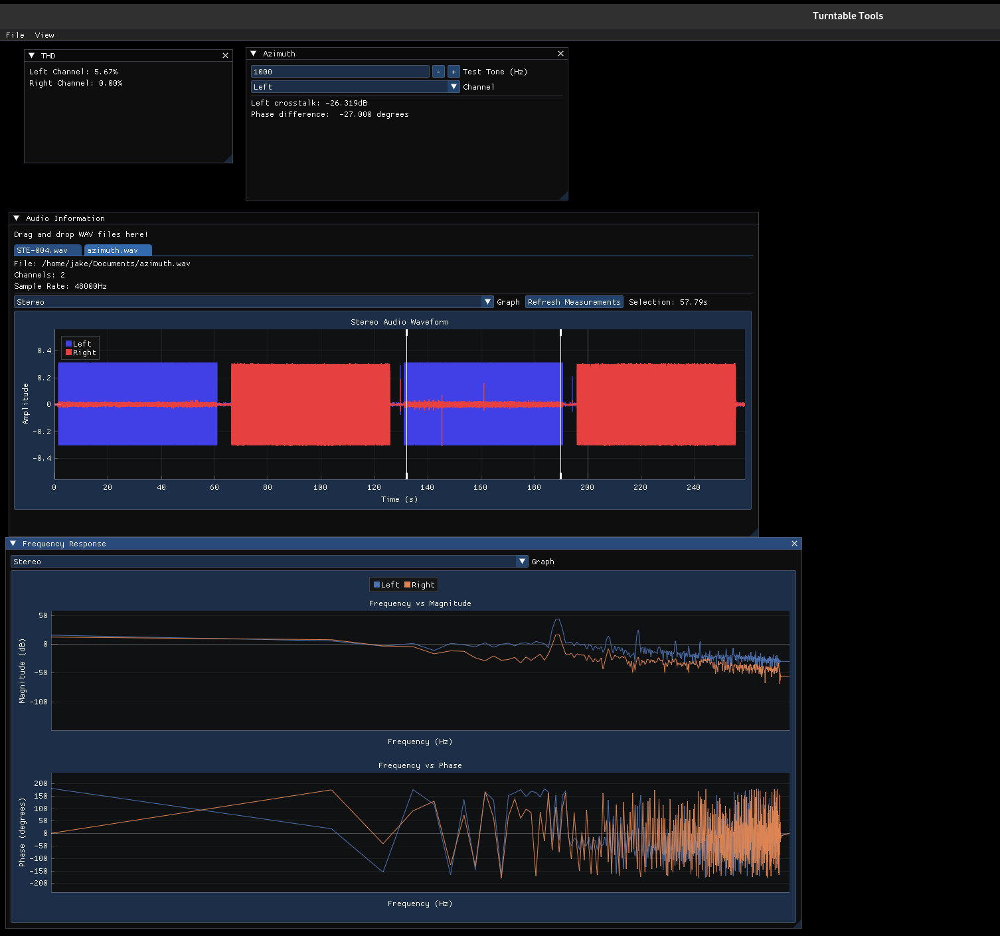

# TurntableTools

This is the TurntableTools project.

# Building

```
cmake -B build
cmake --build build
./build/TurntableTools
```

# GUI Overview

There are three windows available right now:

## Audio Information

This is where you will find an overview of the wav file you want to test.

Key features:

The audio selection that you want to test.

Refresh Measurements Button will kick off all the measurements.

## Azimuth

This is where you will look for Azimuth. To measure this you need to play a track that has a tone playing on one track. You need to do this for both channels.

Select your test tone the default 1000 Hz.

Channel selection to get an accurate measurement you need to select the channel you tested.

Phases difference (Not sure how relevant this is)

## THD

Show the THD of Left and Right channel.

## Frequency Response

This shows you the frequency response of the cartridge. You will need to play a frequency sweep to get this measurement.

## Screenshot


