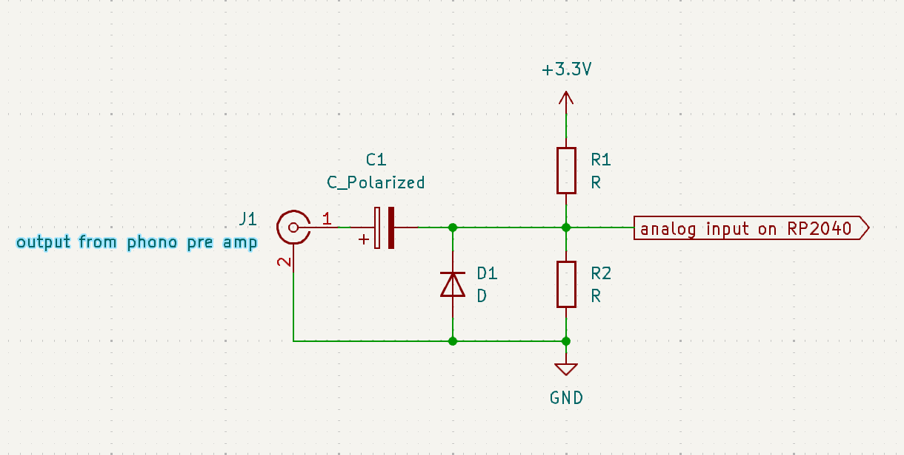
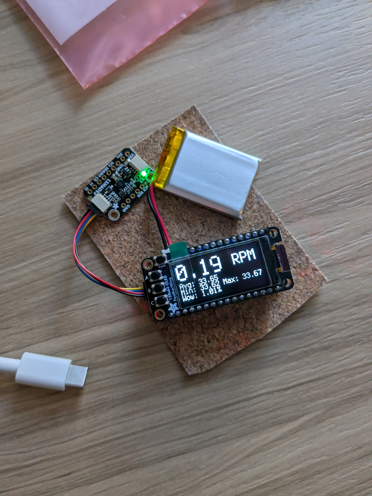
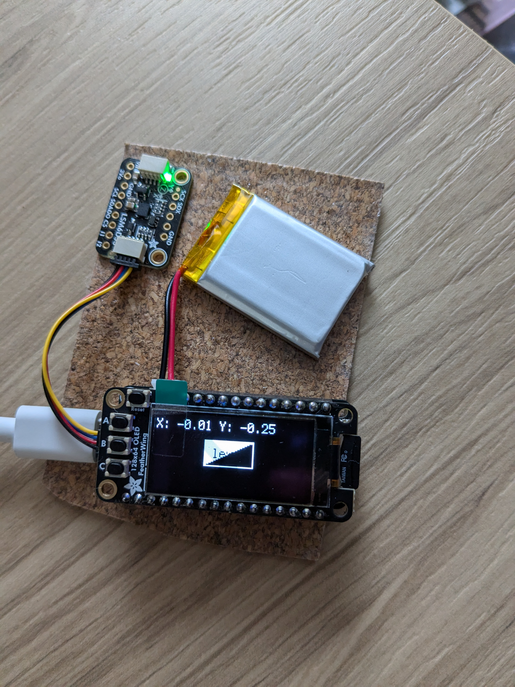
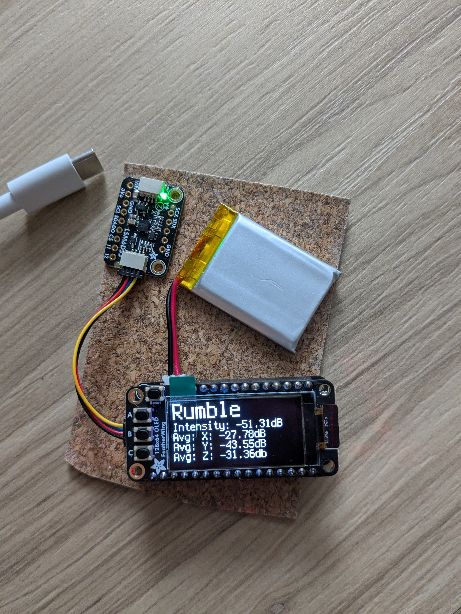
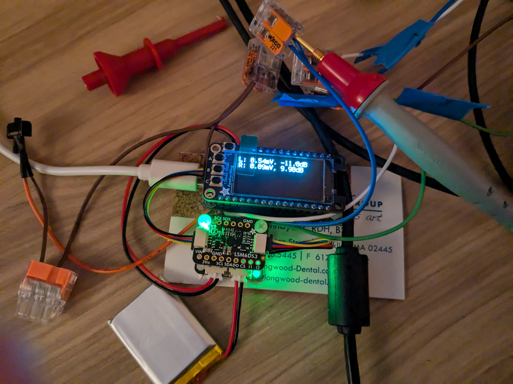

# Turntable-Tools

The goal of this project is to make an device that measure RPM, Wow, Flutter, Rumble and help Level a turntable.

Right now I am using a AdaFruit Feather board's build in adc and a mems device.

## Hardware:

- [Adafruit Feather RP2040 Adalogger](https://www.adafruit.com/product/5980)
- [Adafruit FeatherWing OLED - 128x64 OLED](https://www.adafruit.com/product/4650)
- [Adafruit LSM6DS3TR-C 6-DoF Accel + Gyro IMU](https://www.adafruit.com/product/4503) (for RPM, leveling, and rumble)
- [Battery](https://www.adafruit.com/product/4236) (Size of batter is up to you this is the one I used)
- [Adafruit MAX17048](https://www.adafruit.com/product/5580) (Optional used for monitoring battery status)
- [Power Switch](https://www.adafruit.com/product/805) (Optional)
- STEMMA QT 4pin cable (Number depends on how you build the circuit)
- JST-PH 2-pin Jumper Cable (Depends which power status circuit you use)
- DC Offset Circut for ADC
  - 2 RCA connectors
  - 2 Resistors of the same value (10kohm)
  - 1 Capacitor (10uF)
  - 1 Diode (1N4148)
  - Some wire

## Wiring

Most of the wiring is done with STEMMA QT except for the [power switch](https://io.adafruit.com/blog/tip/2016/12/14/feather-power-switch/).

## Button Controls:

### Main Menu:

- A: Move selection up
- B: Select
- C: Move selection down

### RPM Mode:

This mode will show a real time rpm value. If you start the measurement it will find the avg, min, max rpms, and wow and flutter.

- A: Back to main menu
- B: Start measuring RPM data

### Leveling Mode:

This mode helps you level your turntable.

- A: Back to main menu

### Rumble Mode:

This mode will let you measure the rumble of your turntable in dB.

- A: Back to main menu
- B: Start measuring rumble data

### Calibration MEMs Mode:

This mode will try and reduce noise from the sensor.

- A: Back to main menu
- B: Starts calibration

### Azimuth Mode:

This works by getting the output from a test record from your turntable pre-amp and running through the RP2040's ADC. The signal will need a DC offset for the ADC to work correctly, so I made this simple circuit below.

This will give the input signal VCC/2 offset, this is done with the resistors in a voltage divider configuration. The capacitor is for DC decoupling the input, and the diode is used to clamp the signal above 0V.

- A: Back to main menu
- B: Freeze the measurements
- C: Clears the crosstalk moving avg.

### About Page:

- A: Back to main menu

More to come soon.

